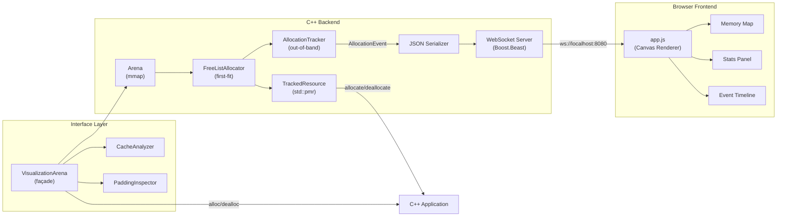

# Memory Mapping Visualization

A real-time memory allocator visualization tool. A C++ backend provides a controlled `mmap`-backed arena with a first-fit free-list allocator exposed via `std::pmr::memory_resource`. Every allocation and deallocation is tracked out-of-band and streamed over WebSocket to an HTML5 Canvas frontend that renders the memory map live.

## System Architecture



### Data Flow

1. **Test program** allocates/deallocates via `TrackedResource` (standard `std::pmr::memory_resource` interface)
2. `TrackedResource` delegates to `FreeListAllocator` and records metadata in `AllocationTracker`
3. `AllocationTracker` computes live stats (fragmentation, free block count) and invokes the event callback
4. The callback serializes the `AllocationEvent` to JSON and broadcasts it via `WsServer`
5. The browser frontend receives events over WebSocket, updates its internal state, and re-renders the Canvas at 60fps

## Prerequisites

| Dependency | Version | Install |
|---|---|---|
| C++ Compiler | Clang 17+ or GCC 14+ | Xcode / `brew install gcc` |
| CMake | 3.28+ | `brew install cmake` |
| Boost | 1.83+ (headers) | `brew install boost` |
| nlohmann/json | 3.11+ | `brew install nlohmann-json` |
| Google Test | 1.14+ | `brew install googletest` |
| Google Benchmark | 1.8+ | `brew install google-benchmark` |

Install all at once:
```bash
brew install cmake boost nlohmann-json googletest google-benchmark
```

## Build Instructions

### Debug Build
```bash
cmake -B build -DCMAKE_BUILD_TYPE=Debug
cmake --build build
```

### Release Build
```bash
cmake -B build-rel -DCMAKE_BUILD_TYPE=Release
cmake --build build-rel
```

### Sanitizer Builds
```bash
# AddressSanitizer
cmake -B build-asan -DCMAKE_BUILD_TYPE=Asan
cmake --build build-asan

# ThreadSanitizer
cmake -B build-tsan -DCMAKE_BUILD_TYPE=Tsan
cmake --build build-tsan

# UndefinedBehaviorSanitizer
cmake -B build-ubsan -DCMAKE_BUILD_TYPE=Ubsan
cmake --build build-ubsan
```

## Usage

### Run the Demo
```bash
./build/memory_mapper
```

Then open [http://localhost:8080](http://localhost:8080) in your browser. The demo runs a 5-phase allocation sequence:

1. **Startup** — 10 allocations of varying sizes (64B–4KB)
2. **Fragmentation** — frees every other block
3. **Large allocations** — tests allocation under fragmentation
4. **Churn** — random alloc/dealloc steady-state
5. **Cleanup** — frees all remaining blocks

### Heatmap Overlay
Click **"Heatmap: OFF"** in the legend to toggle the allocation heatmap. Frequently accessed memory regions glow from blue (cold) → orange (warm) → red (hot). The heatmap accumulates across all alloc/dealloc events.

### Export / Import / Replay
- **⬇ Export**: Downloads all recorded events as a JSON file
- **⬆ Import**: Loads a previously exported JSON event log
- **▶ Replay**: Plays back imported events at 4× speed with visual animation. Click **⏹ Stop** to abort.

### Use as a Library (Low-Level)

```cpp
#include "allocator/arena.hpp"
#include "allocator/free_list.hpp"
#include "allocator/tracked_resource.hpp"
#include "tracker/tracker.hpp"

auto arena = mmap_viz::Arena::create(1024 * 1024).value(); // 1 MB
mmap_viz::FreeListAllocator allocator{arena};
mmap_viz::AllocationTracker tracker{allocator};
mmap_viz::TrackedResource resource{allocator, tracker};

// Use as std::pmr::memory_resource
std::pmr::vector<int> vec{&resource};
vec.push_back(42);
```

### Use as a Library (VisualizationArena Façade)

The `VisualizationArena` wraps the entire pipeline into a single object:

```cpp
#include "interface/visualization_arena.hpp"
#include "interface/padding_inspector.hpp"

// Create a 1 MB arena with auto-detected cache-line size
auto arena = mmap_viz::VisualizationArena::create({
    .arena_size = 1024 * 1024,
}).value();

// Typed allocation
int* p = arena.alloc<int>("counter", 42);
double* d = arena.alloc<double>("weight", 3.14);

// Raw allocation
void* buf = arena.alloc_raw(256, 64, "io_buffer");

// PMR interop
std::pmr::vector<int> vec{arena.resource()};
vec.push_back(10);

// --- Diagnostics ---

// Padding waste analysis
auto pad = arena.padding_report();
std::cout << "Efficiency: " << pad.efficiency * 100 << "%\n";

// Cache-line utilization
auto cache = arena.cache_report();
std::cout << "Avg utilization: " << cache.avg_utilization * 100 << "%\n";
std::cout << "Split allocations: " << cache.split_allocations << "\n";

// JSON export
auto json = arena.snapshot_json();

// Cleanup
arena.dealloc(p);
arena.dealloc(d);
arena.dealloc_raw(buf, 256);
```

### Struct Layout Inspection

Analyze struct padding at compile time with `MMAP_VIZ_INSPECT`:

```cpp
struct Particle {
    char type;       // 1 byte
    double x, y, z;  // 24 bytes — but 7 bytes padding after type!
    int id;          // 4 bytes
};

auto info = MMAP_VIZ_INSPECT(Particle, type, x, y, z, id);
std::cout << "Size: " << info.total_size << "B, "
          << "Useful: " << info.useful_bytes << "B, "
          << "Padding: " << info.padding_bytes << "B, "
          << "Efficiency: " << info.efficiency * 100 << "%\n";

for (const auto& f : info.fields) {
    std::cout << "  " << f.name << ": offset=" << f.offset
              << " size=" << f.size
              << " padding_before=" << f.padding_before << "\n";
}
```

## Project Structure

```
Memory-Mapping-Visualization/
├── CMakeLists.txt              # Build system
├── README.md                   # This file
├── GEMINI.md                   # AI persona configuration
├── cmake/
│   └── Sanitizers.cmake        # ASan/TSan/UBSan presets
├── src/
│   ├── allocator/
│   │   ├── arena.hpp/cpp       # RAII mmap wrapper
│   │   ├── free_list.hpp/cpp   # First-fit free-list allocator
│   │   └── tracked_resource.hpp # std::pmr::memory_resource bridge
│   ├── interface/
│   │   ├── visualization_arena.hpp/cpp  # Single-entry-point façade
│   │   ├── cache_analyzer.hpp/cpp       # Cache-line utilization analyzer
│   │   └── padding_inspector.hpp        # Padding waste + struct layout
│   ├── tracker/
│   │   ├── block_metadata.hpp  # BlockMetadata, AllocationEvent
│   │   └── tracker.hpp/cpp     # Out-of-band allocation tracker
│   ├── serialization/
│   │   └── json_serializer.hpp # nlohmann/json ADL serializers
│   ├── server/
│   │   └── ws_server.hpp/cpp   # Boost.Beast WebSocket + HTTP server
│   └── main.cpp                # Demo entry point
├── web/
│   ├── index.html              # Single-page visualizer
│   ├── style.css               # Dark-theme styling
│   └── app.js                  # Canvas renderer + WebSocket client
├── tests/
│   ├── test_arena.cpp                 # Arena unit tests (7 tests)
│   ├── test_free_list.cpp             # FreeList unit tests (11 tests)
│   ├── test_tracker.cpp               # Tracker unit tests (6 tests)
│   ├── test_visualization_arena.cpp   # Façade unit tests (16 tests)
│   └── test_cache_analyzer.cpp        # Cache analyzer tests (11 tests)
└── bench/
    └── bench_allocator.cpp     # Micro-benchmarks
```

## Testing

### Run All Tests
```bash
cd build && ctest --output-on-failure
```

### Run Benchmarks
```bash
./build/memory_mapper_bench
```

## Configuration

| Parameter | Default | Location |
|---|---|---|
| Arena size | 1 MB | `main.cpp:kArenaSize` |
| Server port | 8080 | `main.cpp:kPort` |
| Demo delay | 250–500ms | `run_demo()` sleep calls |
| Max timeline events | 200 | `app.js:MAX_TIMELINE_EVENTS` |

## Server Simulation

A standalone simulation tool (`server_sim`) puts the `VisualizationArena` under high-bandwidth load to test performance and visualization stability.

### Usage

```bash
./build/server_sim [options]
```

**Options:**
- `--requests <N>`: Total requests to simulate (default: 1000).
- `--pattern <P>`: Traffic pattern (`steady`, `burst`, `ramp`, `mixed`).
- `--arena-mb <N>`: Arena size in MB (default: 4).
- `--server`: Enable the WebSocket visualization server (connect browser to `localhost:8080`).
- `--port <N>`: WebSocket port (default: 8080).

### Example

Simulate 5,000 mixed requests with live visualization:

```bash
./build/server_sim --requests 5000 --pattern mixed --server
```

Open `http://localhost:8080` in your browser to watch the memory churn in real-time.

### Traffic Patterns

- **Steady**: Constant request rate (good for baseline).
- **Burst**: Intense batches of requests followed by cooldowns (tests recovery).
- **Ramp**: Linearly increasing load (finds breaking points).
- **Mixed**: Alternating user-like behavior (realistic stress test).

## License

See [LICENSE](LICENSE).
